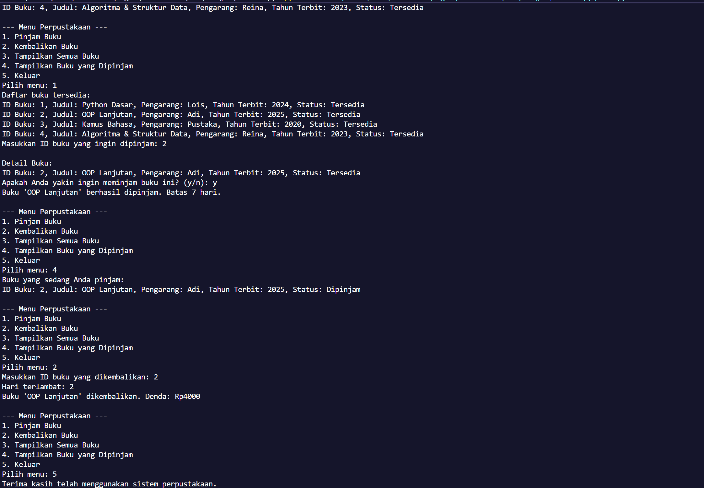
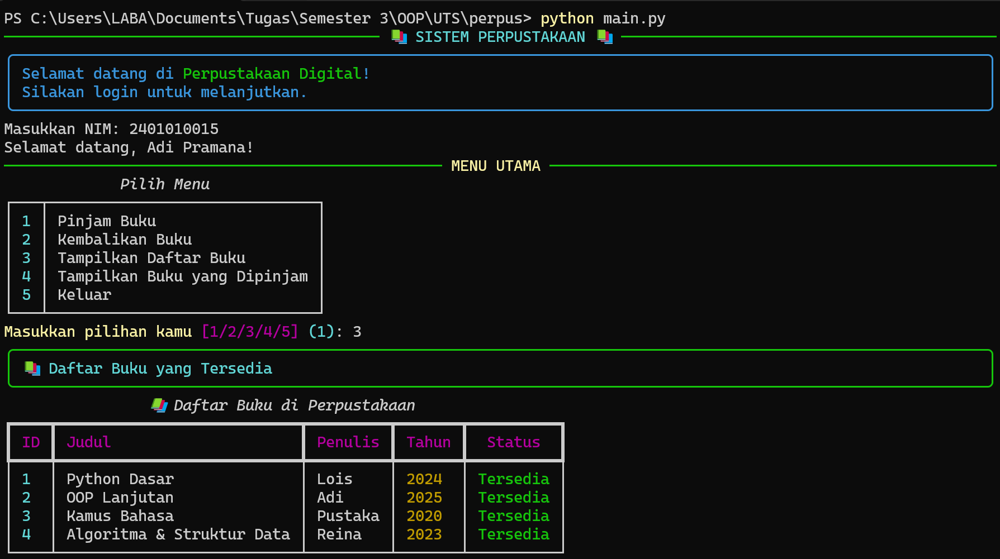
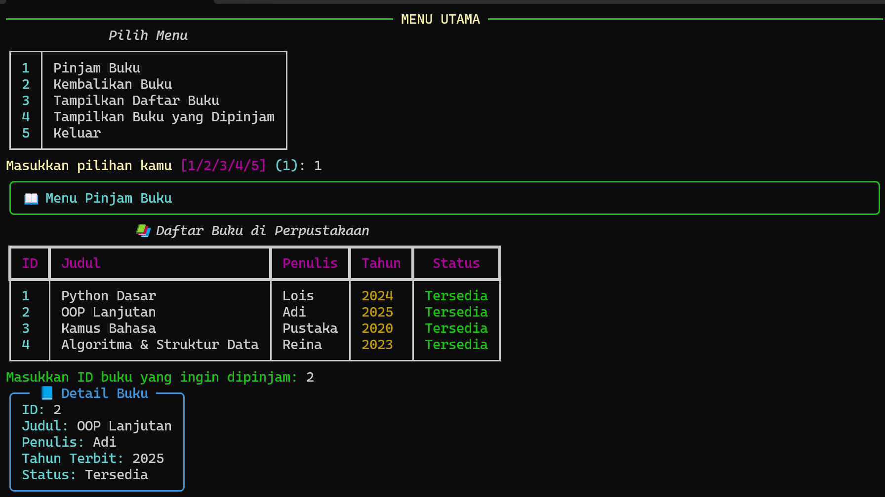
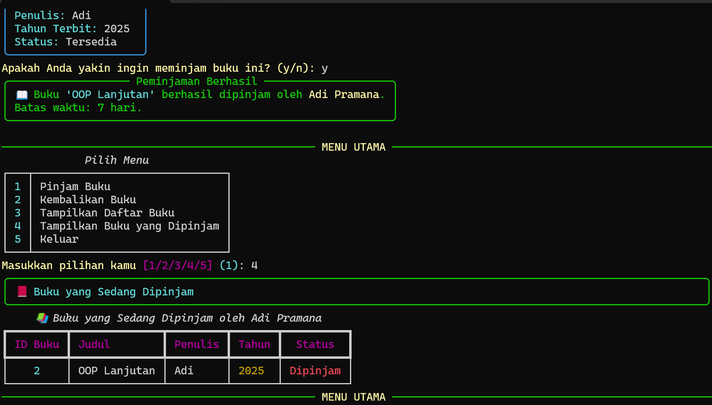

# 📚 S3-UTS-OOP

Proyek ini merupakan tugas **UTS Mata Kuliah Pemrograman Berorientasi Objek (OOP)**.  
Sistem ini mensimulasikan **aplikasi perpustakaan sederhana berbasis terminal**, dengan fitur utama seperti:

- 👤 Manajemen Anggota  
- 📖 Daftar Buku  
- 🔁 Peminjaman & Pengembalian Buku  
- 🎨 Tampilan interaktif menggunakan modul [Rich](https://github.com/Textualize/rich)

---

## 🚀 Sebelum & Sesudah Menggunakan Rich

### 🎛️ Tampilan Sebelum (Plain Terminal)

### 🌈 Tampilan Sesudah (Dengan Rich)

| Tampilan | Gambar |
|-----------|---------|
| Menu Utama |  |
| Daftar Buku |  |
| Buku Dipinjam |  |
| Pengembalian Buku |  |

---

